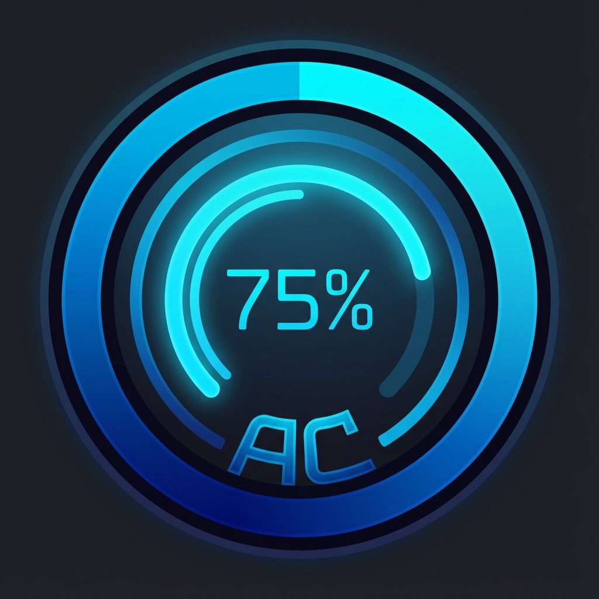

# TechQuotas Antigravity

<p align="center">
  
</p>

<p align="center">
  <strong>Advanced Quota Monitoring for Antigravity IDE</strong><br>
  Visual gauges • Per-model tracking • Real-time updates
</p>

---

## Features

### 🎯 Visual Gauge Indicators
Circular gauge icons in the status bar show quota usage at a glance:
- `○` Empty (0-12%)
- `◔` Quarter (13-37%)
- `◑` Half (38-62%)
- `◕` Three-quarters (63-87%)
- `●` Full (88-100%)

### 📊 Per-Model Tracking
See individual quota status for each AI model:
- Claude Sonnet 4.5
- Gemini 3 Pro
- GPT-OSS
- And more...

### 🎨 Color Coding
Instant visual feedback:
- 🟢 **Green**: Healthy (>50% remaining)
- 🟡 **Yellow**: Warning (20-50% remaining)
- 🔴 **Red**: Critical (<20% remaining)

### 🔧 Built-in D:\ Fix
Works flawlessly even when your workspace is at `D:\` root directory!

---

## Installation

### From VSIX (Recommended)
1. Download `TechQuotas Antigravity.vsix`
2. Open Antigravity IDE
3. Press `Ctrl+Shift+P` → "Extensions: Install from VSIX..."
4. Select the downloaded file

### From Source
```bash
git clone https://github.com/ac-tech-pro/TechQuotas-Antigravity.git
cd TechQuotas-Antigravity
npm install
npm run compile
npx vsce package
```

---

## Configuration

Open Settings (`Ctrl+,`) and search for "TechQuotas":

| Setting | Description |
|---------|-------------|
| **Enabled** | Enable/disable monitoring |
| **Polling Interval** | How often to refresh (seconds) |
| **Show Gauges** | Display visual gauge icons |
| **Pinned Models** | Models to always show in status bar |

---

## Commands

Access via Command Palette (`Ctrl+Shift+P`):

| Command | Description |
|---------|-------------|
| `TechQuotas: Refresh Now` | Manually refresh quota data |
| `TechQuotas: Reconnect` | Reconnect to Antigravity process |
| `TechQuotas: Show Debug Log` | Open debug output panel |

---

## Credits

- **Original Base**: [AG Quota](https://github.com/Henrik-3/AntigravityQuota) by Henrik Mertens
- **Fork & Enhancements**: [AC Tech](https://github.com/ac-tech-pro)
  - Moacir Costa ([@moacirbcj](https://github.com/moacirbcj))
  - Vinicyus Abdala ([@vinzabdala](https://github.com/vinzabdala))

---

## License

MIT License - See [LICENSE](LICENSE) for details.

---

<p align="center">
  Made with ❤️ by <a href="https://ac-tech.pro">AC Tech</a>
</p>
